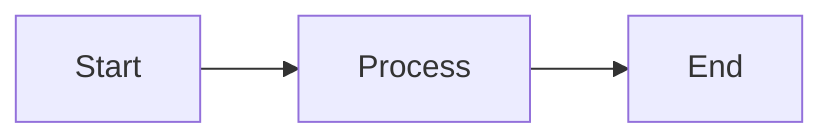

# Portfolio & Blog

A modern, type-safe portfolio and blog built with Astro, featuring automated content management and a minimal design.

## ✨ Features

- 🚀 **Type-safe content system** with centralized configuration
- 📝 **Content Collections** for blog posts, projects, and work experience
- 🏷️ **Centralized tag system** for consistency across content
- 🎨 **Interactive content creator** for easy content generation
- 🔄 **Auto-sync frontmatter** from TypeScript configs
- 📊 **Showcase system** for curated content display
- 🎯 **100/100 Lighthouse performance**
- 🌓 **Light/Dark theme** with smooth transitions
- 📱 **Fully responsive** design
- ♿ **Accessible** and SEO-friendly
- 📊 **Mermaid diagrams** support
- 🔍 **Full-text search** with Fuse.js

## 🛠️ Tech Stack

- **Framework:** [Astro](https://astro.build/) 5.x
- **Styling:** [Tailwind CSS](https://tailwindcss.com/) 3.x
- **Language:** TypeScript
- **Package Manager:** pnpm
- **Code Quality:** Biome (linting & formatting)
- **Diagrams:** Mermaid (via astro-mermaid)

## 📦 Package Manager

This project uses **pnpm**. Always use `pnpm` commands instead of npm or yarn.

```bash
# Install pnpm globally if you haven't already
npm install -g pnpm
```

## 🚀 Getting Started

### Installation

```bash
# Clone the repository
git clone https://github.com/paugarcia32/paugarcia32.dev.git
cd paugarcia32.dev

# Install dependencies
pnpm install

# Start development server
pnpm dev
```

The site will be available at `http://localhost:4321`

### Development Commands

| Command | Description |
|---------|-------------|
| `pnpm dev` | Start dev server with auto-sync (recommended) |
| `pnpm dev:no-sync` | Start dev server without frontmatter auto-sync |
| `pnpm dev:network` | Start dev server on local network |
| `pnpm build` | Build for production (runs type check first) |
| `pnpm preview` | Preview production build locally |
| `pnpm preview:network` | Preview build on local network |
| `pnpm lint` | Lint code with Biome |
| `pnpm lint:fix` | Auto-fix linting issues and format code |
| `pnpm format` | Format code only |
| `pnpm create-content` | Interactive content creator (blog/project/work) |
| `pnpm sync-frontmatter` | Manually sync frontmatter from configs |

## 📁 Project Structure

### Content Collections

Content is organized into three collections under `src/content/`:

```
src/content/
├── blog/           # Blog posts
│   ├── post-slug/
│   │   ├── config.ts    # Post metadata (source of truth)
│   │   └── index.md(x)  # Post content with auto-synced frontmatter
│   └── index.ts         # Export all blog posts
├── projects/       # Project portfolio
│   ├── project-slug/
│   │   ├── config.ts    # Project metadata
│   │   └── index.md(x)  # Project description
│   └── index.ts         # Export all projects
└── work/           # Work experience
    ├── company-slug/
    │   ├── company.ts   # Company info
    │   ├── company.md   # Company description
    │   ├── position.ts  # Position metadata
    │   └── position.md  # Position description
    └── index.ts         # Export all work data
```

### Key Files

- **`src/consts.ts`** - Site-wide configuration (name, email, social links)
- **`src/tags.ts`** - Centralized tag definitions
- **`src/types.ts`** - TypeScript type definitions
- **`src/showcases.ts`** - Configure what content appears on homepage/CV
- **`src/lib/utils.ts`** - Utility functions
- **`scripts/`** - Build and development scripts

## 📝 Content Management

### Creating Content (Recommended Method)

Use the interactive content creator for the best experience:

```bash
pnpm create-content
```

This will guide you through:
1. **Select content type:** Blog Post, Project, or Work Experience
2. **Enter details:** Title, description, dates, URLs, etc.
3. **Select tags:** Multi-select from existing tags
4. **Choose format:** Markdown (.md) or MDX (.mdx)
5. **Auto-create:** Generates all necessary files and syncs frontmatter

### Manual Content Creation

If you prefer to create content manually:

#### Blog Post

1. Create directory: `src/content/blog/my-post-slug/`
2. Create `config.ts`:

```typescript
import * as TAGS from "@/tags";
import type { BlogPostReference } from "@/types";

export default {
  slug: "my-post-slug",
  config: {
    title: "My Post Title",
    description: "Post description",
    date: new Date("2026-02-16"),
    draft: false,
    tags: [TAGS.JAVASCRIPT, TAGS.WEB_DEVELOPMENT],
  },
} as const satisfies BlogPostReference;
```

3. Create `index.md` or `index.mdx`:

```markdown
---
title: "My Post Title"
description: "Post description"
date: "Feb 16, 2026"
tags: ["JavaScript", "Web Development"]
---

# My Post Title

Your content here...
```

4. Add to `src/content/blog/index.ts`:

```typescript
import myPost from "./my-post-slug/config";

export const blogPosts = {
  // ... existing posts
  myPost,
} as const;
```

5. Run sync: `pnpm sync-frontmatter`

#### Project

Similar to blog posts, but use `ProjectReference` type and add optional `demoURL`, `repoURL`, and `workPosition` fields.

To link a project to a work position, add the `workPosition` field with the value `"company-slug/position-slug"` (matching the folder and filename under `src/content/work/`):

```typescript
export default {
  slug: "my-project",
  config: {
    title: "My Project",
    description: "...",
    date: new Date("2025-01-01"),
    draft: false,
    workPosition: "maat/junior-engineer", // links to src/content/work/maat/junior-engineer.md
    tags: [TAGS.FLUTTER],
  },
} as const satisfies ProjectReference;
```

This will:
- Show a badge on the project detail page linking to the work position
- Show the project under "Projects" in the work experience page for that position

The `pnpm create-content` tool will also prompt you to link a project to a work position interactively.

#### Work Experience

1. Create/use company directory: `src/content/work/company-slug/`
2. Create company files if new (company.ts, company.md)
3. Create position files (position-slug.ts, position-slug.md)
4. Position configs use `dateStart` and `dateEnd` (can be Date or "Present")

## 🏷️ Tag System

Tags are centrally defined in `src/tags.ts`:

```typescript
// Languages
export const PYTHON = "Python";
export const JAVASCRIPT = "JavaScript";
export const TYPESCRIPT = "TypeScript";

// Frameworks
export const REACT = "React";
export const ASTRO = "Astro";

// Topics
export const IOT = "IoT";
export const AI = "AI";
// ... more tags
```

**Benefits:**
- ✅ Type-safe tag references
- ✅ Autocomplete in your IDE
- ✅ Consistent naming across all content
- ✅ Easy to add new tags in one place

**Usage in config.ts:**

```typescript
import * as TAGS from "@/tags";

tags: [TAGS.REACT, TAGS.TYPESCRIPT]
```

## 🔄 Frontmatter Sync System

The project uses a **config-first** approach:

1. **Source of truth:** `config.ts` files contain all metadata
2. **Frontmatter:** Auto-synced from configs (don't edit manually)
3. **Auto-watch:** When `pnpm dev` is running, config changes auto-sync
4. **Manual sync:** Run `pnpm sync-frontmatter` to sync all files

### Why Two Sources?

- **config.ts:** Type-safe, used in TypeScript code, centralized exports
- **frontmatter:** Required by Astro Content Collections for schema validation

The sync script ensures they stay in sync automatically.

## 🎯 Showcase System

Control what content appears on your homepage (and future pages like CV) using `src/showcases.ts`:

```typescript
import { blogPosts } from "@content/blog";
import { projects } from "@content/projects";

export const HOMEPAGE: Types.Showcase = {
  blog: [
    blogPosts.latestPost,
    blogPosts.featuredPost,
    blogPosts.tutorial,
  ],
  projects: [
    projects.mainProject,
    projects.sideProject,
    projects.experiment,
  ],
  work: [
    { company: "current-company", limit: 2 }, // Show 2 most recent positions
  ],
};
```

**Benefits:**
- ✅ Explicit control over what appears
- ✅ Easy reordering (just move items in array)
- ✅ Type-safe references (autocomplete works)
- ✅ Scalable for multiple showcases (homepage, CV, etc.)

## 🎨 Styling

- **Framework:** Tailwind CSS with custom configuration
- **Typography:** Tailwind Typography plugin for prose content
- **Fonts:** Inter (sans-serif) and Lora (serif) via @fontsource
- **Dark Mode:** Class-based with smooth transitions
- **Theme Toggle:** Animated sun/moon icon in navigation

## 📊 Mermaid Diagrams

Mermaid diagrams are supported in both `.md` and `.mdx` files:

````markdown

````

Diagrams adapt to light/dark theme automatically.

## 🔍 Search

Full-text search is powered by Fuse.js, searching across:
- Blog post titles and descriptions
- Project titles and descriptions
- Work experience roles and descriptions

## 🏗️ Site Configuration

Edit `src/consts.ts` to configure:

```typescript
export const SITE: Site = {
  TITLE: "Your Name",
  DESCRIPTION: "Your portfolio description",
  EMAIL: "you@example.com",
  // ...
};

export const SOCIALS: Socials = [
  {
    NAME: "GitHub",
    HREF: "https://github.com/yourusername",
    ICON: "github",
  },
  // ... more social links
];
```

## 📝 Code Quality

This project uses [Biome](https://biomejs.dev/) for linting and formatting:

- **Semicolons:** Always required
- **Quotes:** Double quotes
- **Indentation:** 2 spaces
- **Import organization:** Automatic
- **Format on save:** Enabled (in Zed)

Run checks:
```bash
pnpm lint         # Check for issues
pnpm lint:fix     # Auto-fix issues + format
pnpm format       # Format only
```

## 🚀 Deployment

### Build

```bash
pnpm build
```

This runs type checking and builds the site to `./dist/`

### Preview

```bash
pnpm preview
```

Preview the production build locally.

### Deploy

The site can be deployed to any static hosting platform:

- **Vercel** (recommended)
- **Netlify**
- **GitHub Pages**
- **Cloudflare Pages**

Make sure to set the build command to `pnpm build` and output directory to `dist`.

## 📚 Path Aliases

TypeScript path aliases for cleaner imports:

```typescript
import { SITE } from "@consts";           // src/consts.ts
import type { BlogPost } from "@/types";   // src/types.ts
import * as TAGS from "@/tags";            // src/tags.ts
import { blogPosts } from "@content/blog"; // src/content/blog/index.ts
import { cn } from "@lib/utils";           // src/lib/utils.ts
```

## 🎓 Learning Resources

This project demonstrates:
- **Astro Content Collections** for type-safe content
- **TypeScript** best practices (const assertions, satisfies)
- **Tailwind CSS** utility-first styling
- **File-based routing** with Astro
- **RSS feed** generation
- **Sitemap** generation
- **Dark mode** implementation
- **Search functionality** with Fuse.js

## 📄 License

MIT

---

Built with ❤️ using [Astro](https://astro.build/)
