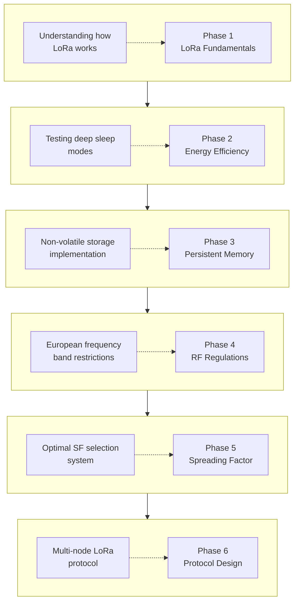

# Project Overview

The purpose of this work is to develop a tool to carry out citizen science projects.

Citizen science projects are aimed at generating new knowledge with the active and essential participation of citizens at some stage of the project's research process.

Specifically, this work aims to develop an IoT (Internet of Things) device that, depending on its use, is low-cost, easy to use, suitable for operating in environments with different connectivity possibilities, can be coupled with different types of sensors and can be easily programmed, to adapt the device to the project in which it is being used.
This work focuses on the connectivity part.

The final objective, beyond this work, is the development of a solid solution that provides various connectivity possibilities, within a robust environment, that allows communication in various ways with, for example, a weather station. Therefore, in this work, as a first step, the objective has been defined as developing a platform that supports different connectivity technologies in order to facilitate its configuration and subsequent connection to the Internet to collect the generated data.

To achieve this objective, the partial objectives have been defined as designing and developing a proof of concept of an IoT protocol that allows connectivity between several nodes. This need is given by the use of LoRa (Long Range) in scenarios where there is no Wi-Fi coverage. On the other hand, the objective has also been defined as investigating and implementing energy saving solutions, solutions for a possible simple configuration of the nodes and the possibility of saving data in non-volatile memory to avoid losing configuration data in possible power losses.

# Design Process

